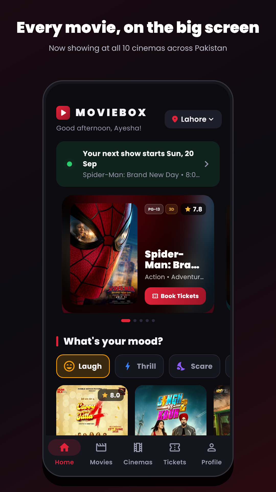
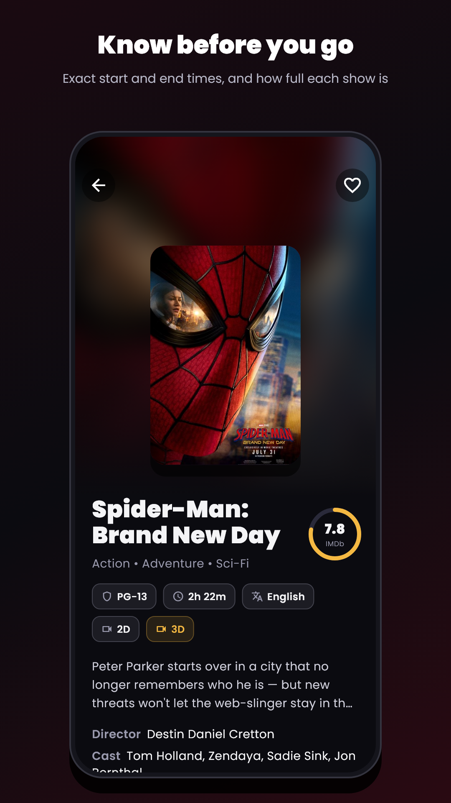
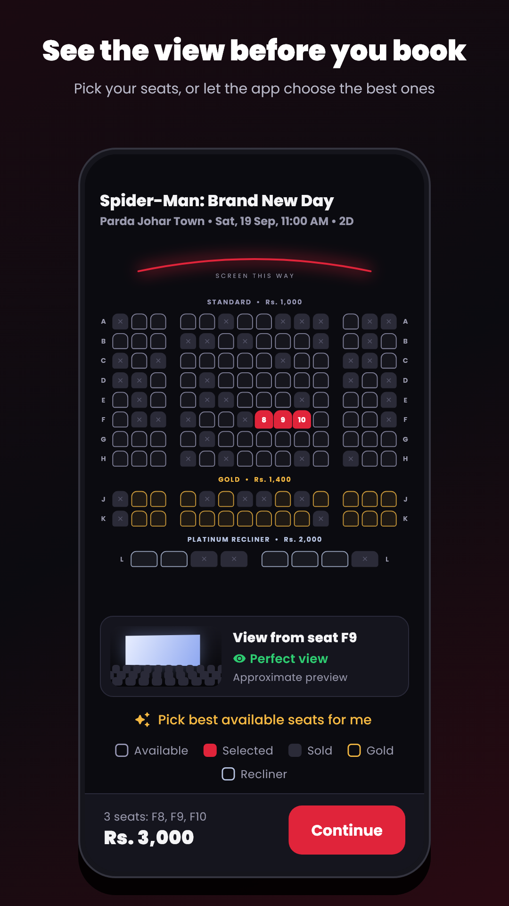
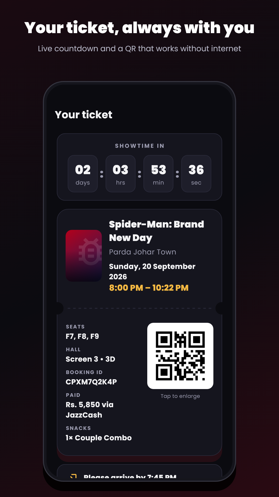
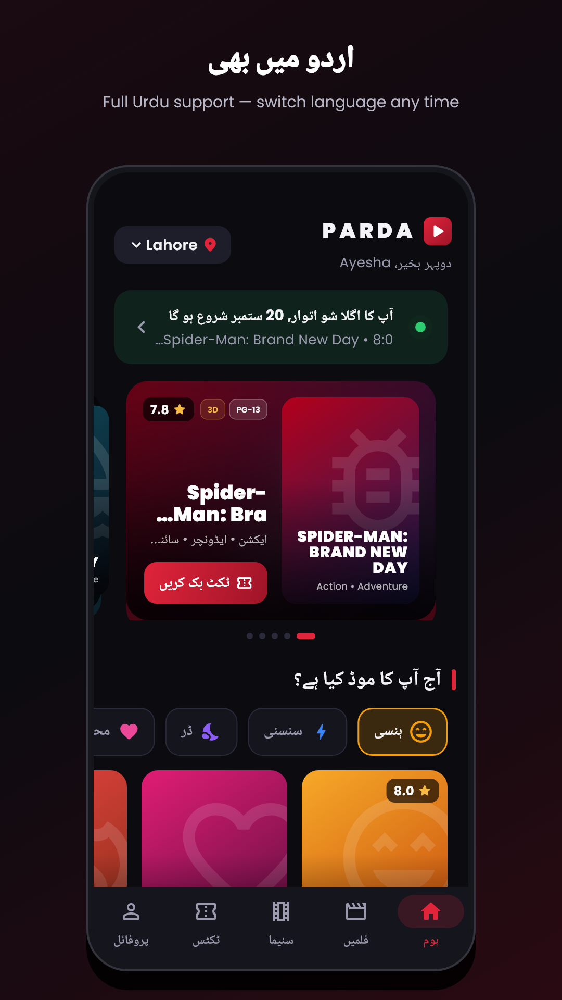
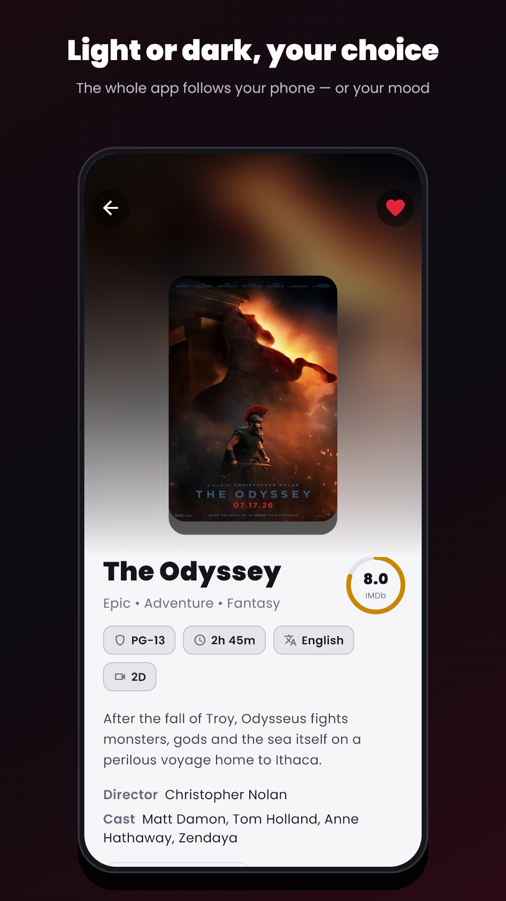

# MovieBox

[](https://github.com/twinstack-studio/moviebox/actions/workflows/ci.yml)
[](./LICENSE)
[](https://moviebox.twinstackstudio.com)

MovieBox is a movie ticket booking app for a cinema chain in Pakistan, built with Flutter
for Android, iOS and the web from one codebase. Guests browse what is showing,
pick seats on a live seat map, pre-order snacks, pay with a card or a mobile
wallet, and carry a QR ticket that works offline, in English or Urdu.

[**Open the live demo**](https://moviebox.twinstackstudio.com) ·
[**Work with TwinStack Studio**](https://twinstackstudio.com/contact)

| | | |
| --- | --- | --- |
|  |  |  |
|  |  |  |

> **Note:** MovieBox is a fictional cinema brand created for this portfolio
> project. Cinemas, showtimes, prices and seat availability are demo data.
> **No real payments are taken:** checkout accepts only the demo card
> `4242 4242 4242 4242` (the "Use demo details" button fills it in), and the
> sign-in code is always `1234`. Film titles and posters belong to their
> respective studios.

## What the product delivers

### For moviegoers

- **Onboarding:** pick a city and a favourite cinema, and showtimes filter to them
- **Home:** auto-scrolling hero carousel, Now Showing, Coming Soon with reminders, offers and your next show
- **Movies:** search by title, actor or language, genre filters, a watchlist and a "What's your mood?" picker
- **Movie pages:** synopsis, cast, trailer, a 7-day date strip and showtimes grouped by cinema, each with its start and end time and how full it is
- **Seat selection:** zoomable seat map with Standard, Gold and Platinum recliner pricing and an 8-minute seat hold
- **View from your seat:** a live preview of the screen from the chosen seat
- **Best available seats:** choose a group size and the app picks the best adjacent seats
- **Snacks pre-order:** combos, popcorn and drinks collected with the ticket
- **Checkout:** promo codes, cards, JazzCash, Easypaisa and Raast, with a clear price breakdown
- **Tickets:** a QR e-ticket that opens offline, a live countdown to the show, and free cancellation up to 2 hours before
- **Rewards:** 1 point per Rs. 100 spent, with Silver, Gold and Platinum tiers
- **Share and split:** send the booking on WhatsApp with the amount per person
- **Reminders:** a notification one hour before the show, and when bookings open for a watched film
- **Help:** FAQs, a "Report a problem" form that returns a reference number, and one-tap calls to each cinema
- **English and Urdu:** the whole app switches language, and the layout flips to right-to-left for Urdu
- **Dark, light or system appearance**

### For the cinema team

- **App insights:** an in-app dashboard of the booking funnel, revenue, popular films and errors

### Engineering highlights

- **No double charges:** every booking gets a reference before payment, and payment is idempotent on it, so a retry cannot charge twice. The booking is saved only after payment succeeds
- **No late bookings:** online booking closes 10 minutes before each show, and shows after midnight are labelled "Late night"
- **Every screen handles loading, errors and empty results,** and tickets are stored on the phone
- **Backend-ready:** screens talk only to a `CinemaRepository` interface, so a real ticketing API can replace the demo data without touching the UI
- **Analytics-ready:** booking funnel events and uncaught errors go through one `Analytics` service that can forward to Firebase
- **120 Hz ready:** on Android the app requests the screen's fastest refresh rate, and iPhone ProMotion is enabled
- **Motion design:** poster transitions, parallax, shimmer loading, confetti on booking, a ticket "print" animation and haptic feedback
- **Safe public demo:** the web build shows a "No real payments" banner on every screen and keeps the app at phone width on large screens
- **Store screenshots are generated by a test** from the real screens, so they always match the app

## Technology

| Layer | Stack |
| --- | --- |
| Framework | Flutter, Dart |
| Platforms | Android, iOS, web |
| Storage | shared_preferences |
| Notifications | flutter_local_notifications |
| Tickets | qr_flutter |
| Languages | English and Urdu (built-in string table) |
| Tests | flutter_test |

## Project structure

```text
moviebox/
├── assets/          Brand icon, splash mark, film posters and fonts
├── lib/
│   ├── data/        CinemaRepository interface and the demo repository
│   ├── screens/     Home, movies, cinemas, seats, snacks, checkout, tickets, profile, insights
│   ├── services/    Analytics, notifications and display refresh rate
│   ├── state/       App state saved on the phone
│   ├── widgets/     Shared UI, animations and rewards
│   ├── demo.dart    Demo mode: payment notice, demo card and web banner
│   ├── l10n.dart    English to Urdu strings
│   ├── models.dart  Movie, Cinema, Showtime, Seat, Booking
│   └── theme.dart   Colours for dark and light mode
├── screenshots/     Store screenshot generator and output
└── test/            Unit and widget tests
```

## Run locally

Requirements: Flutter (stable channel).

```bash
git clone https://github.com/twinstack-studio/moviebox.git
cd moviebox

flutter pub get
flutter run                 # on a connected phone or emulator
flutter run -d chrome       # in the browser
```

## Useful commands

| Command | What it does |
| --- | --- |
| `flutter analyze` | Check the code for problems |
| `flutter test` | Run the unit and widget tests |
| `flutter test screenshots/store_test.dart --update-goldens` | Regenerate the store screenshots |
| `dart run flutter_launcher_icons` | Regenerate app icons from `assets/branding/icon.png` |
| `dart run flutter_native_splash:create` | Regenerate the splash screen |
| `flutter build apk --release` | Build an Android APK |
| `flutter build web --release` | Build the web version |

## Built by TwinStack Studio

TwinStack Studio builds full-stack websites, web applications, mobile apps,
dashboards, portals, automation, and AI-powered products.

[GitHub](https://github.com/twinstack-studio) ·
[Website](https://twinstackstudio.com) ·
[Email](mailto:hello@twinstackstudio.com)

© 2026 TwinStack Studio. All rights reserved. See [LICENSE](./LICENSE).
